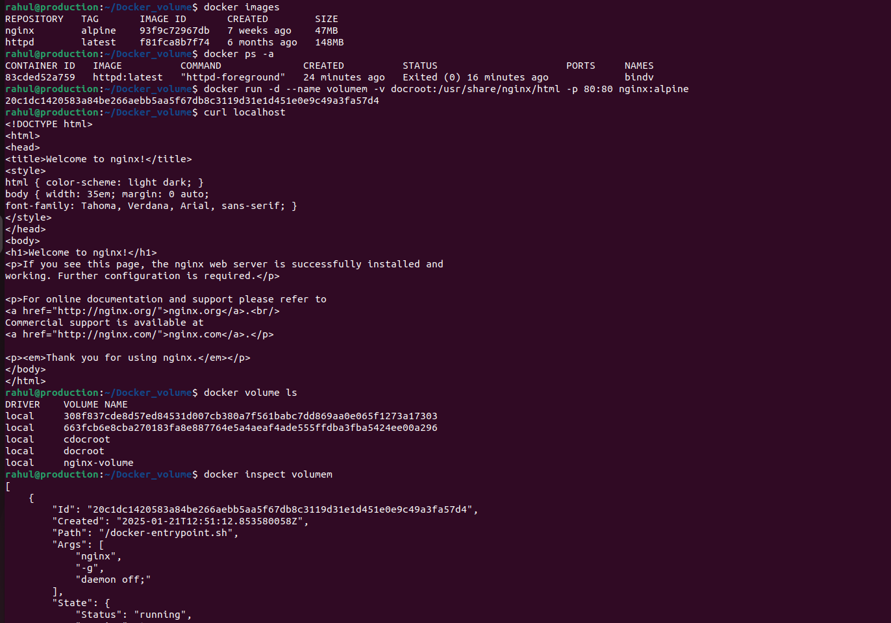

###      Docker volumes are a key feature for managing data in Docker containers. They provide a way to persist and share data between containers, even after a container is removed. Here's an overview of Docker volumes:

1. Bind Mounts: Links a specific directory on the host to the container.

2. Volumes: Managed by Docker (/var/lib/docker/volumes/ on Linux by default).

### 1. Bind Mounts: Links a specific directory on the host to the container.
###  Example Output:

### 2. Volumes: Managed by Docker (/var/lib/docker/volumes/ on Linux by default).
###  Example Output:

